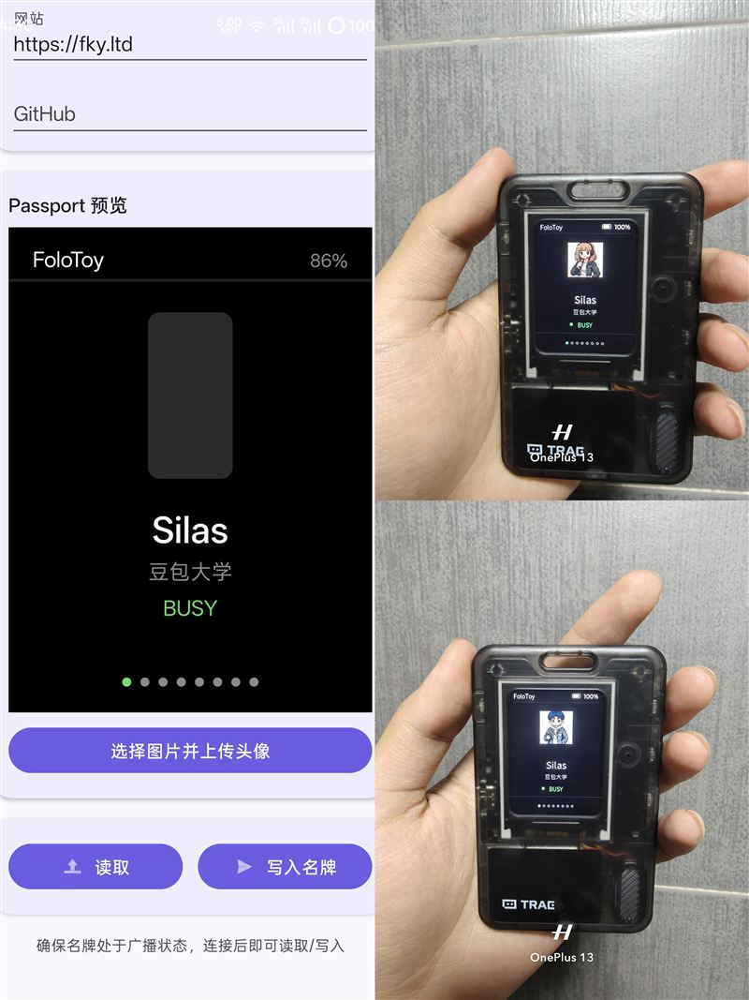

# Passport OS V2 — Personal Smart Badge Firmware

English | [简体中文](README.md)

> A **low-power personal smart badge** firmware for the **ESP32-C3** (progressively transformed from the FoloToy AI Passport). It uses **vertical page navigation** on a 240×320 screen to show your electronic identity — name, title, status, and a QR code — with profile and avatar editable over BLE, minimal and high-contrast, built for low power.

<p align="center">
  
  <br/>
  <em>Passport OS V2 — personal smart badge on device</em>
</p>

---

## At a glance

| Item | Description |
| --- | --- |
| MCU | ESP32-C3 (8 MB Flash, **no PSRAM**, limited internal RAM) |
| Display | ST7789P3, 240×320 portrait RGB565, SPI2 @ 40 MHz |
| Input | Three buttons (`UP` / `DOWN` / `OK`), no touch, shared GPIO0 ADC ladder |
| Audio | ES8311 (I2S0 full-duplex), unrelated to the main UI |
| Battery | CW2017 fuel gauge (optional at runtime; shows `--%` when absent) |
| SDK | ESP-IDF 5.5.x, LVGL 9.5 |
| System | **Vertical Page Navigation** — 8 looping pages, global keys unified by an App Router |

---

## Core interaction: vertical page navigation

The system is not an app-grid menu — it pages **vertically**:

```text
         UP / DOWN          UP / DOWN
              ↑                   ↑
     ┌───────────────┐   ┌───────────────┐
     │   HOME        │   │  PROFILE      │  ... loops back to HOME
     └───────────────┘   └───────────────┘
```

### Three-button semantics (unified by the App Router; pages never manage global keys)

| Button | Short press | Long press |
| --- | --- | --- |
| `UP` | Previous page (wrap) | Return directly to HOME |
| `DOWN` | Next page (wrap) | Quick status toggle |
| `OK` | Enter / act on current page | Return to HOME |

Inside list pages (TOOLS / GAMES / SETTINGS), short **UP/DOWN** select and **OK** enters/acts; long press always follows global semantics.

### The 8 pages

```text
PAGE 0  HOME        Identity: avatar + name + title + status
PAGE 1  PROFILE     Full profile: name / title / status / bio (no link text)
PAGE 2  STATUS      Quick status: AVAILABLE / FOCUS / BUSY / DND / OFFLINE
PAGE 3  CARDS/QR    Personal QR (dynamic; content from the QR field, no link text shown)
PAGE 4  DASHBOARD   Uptime / FOCUS session / BLE / WIFI (honest data, no fake clock)
PAGE 5  TOOLS       TIMER / STOPWATCH / CALCULATOR / MORSE
PAGE 6  GAMES       REACTION / MEMORY / MORSE / CATCH
PAGE 7  SETTINGS    BLE toggle / sleep timeout / firmware version
```

Each page shows a bottom **Page Indicator** (`● ○ ○ ○ ○ ○ ○ ○`) for the current position.

---

## Features

- **Dark minimalist UI** (V2 design system): black `#000000` background, white `#FFFFFF` primary text, `#4CD964` accent, low information density.
- **Custom profile** stored in **NVS** (not compiled into firmware): name, top bar, title, status, bio — editable over BLE, survives power loss.
- **Personal QR**: CARDS page renders a QR dynamically (via `espressif/qrcode`) from the user's custom QR field (e.g. a WeChat/URL link); the page shows no link text.
- **BLE avatar upload**: the phone crops/scales/converts to RGB565, uploads in chunks over BLE; the ESP32 receives → CRC32-checks → saves to SPIFFS (`/avatar.bin`, 80×80 RGB565) → refreshes immediately.
- **3-key navigation**: every key event is dispatched by the App Router.
- **Low power**: configurable idle timeout (30s/1m/2m/5m/never) then **Deep Sleep**, wake on any button; BLE and Wi-Fi default off, turned on only when syncing.
- **Battery display**: CW2017 SOC; orange below 20%, red below 10%, `--%` when the gauge is absent.

---

## BLE customization & avatar (NimBLE)

- **Advertising name**: `FoloToy-Badge`; **GATT service** `0xFFE0`
- **Profile characteristics** (read/write, 16-bit UUIDs; writes persist to NVS):

| UUID | Field | NVS key |
| --- | --- | --- |
| `0xFFE1` | name | `name` |
| `0xFFE2` | top bar text | `top` |
| `0xFFE3` | title | `title` |
| `0xFFE4` | status | `status` |
| `0xFFE5` | bio | `bio` |
| `0xFFE7` | QR content | `qr` |

- **Avatar characteristics** (write-only):

| UUID | Purpose |
| --- | --- |
| `0xFFE8` | `AV_CTRL`: `START <size> <crc32>` / `CANCEL` |
| `0xFFE9` | `AV_DATA`: chunked avatar data; on completion CRC32 is checked and saved if valid |

> Android uses UUIDs shaped `0000FFEx-0000-1000-8000-00805F9B34FB`. The phone app lives in [`android_app/`](android_app/) (with a 240×320 live preview and avatar crop/upload).

---

## Hardware capability contract (BSP)

| Capability | Confirmed implementation | Application interface | Boundaries |
| --- | --- | --- | --- |
| Display | ST7789P3, 240×320 portrait RGB565, SPI2 @ 40 MHz; LEDC backlight | `bsp_display_*`, `bsp_lvgl_*` | No PSRAM; single small DMA buffer; no MISO/touch/TE |
| Input | `UP`/`DOWN`/`OK` share GPIO0 ADC resistor ladder | `bsp_button_init()`, `bsp_button_read_mv()` | Callbacks run in the button task; must not block |
| Audio | ES8311, I2S0 full-duplex PCM (unrelated to main UI) | `bsp_audio_*` | PCM I/O blocking → worker task; format change must close/reopen |
| Battery | CW2017 SOC + voltage | `bsp_battery_*` | Optional at runtime; accuracy depends on cell/profile |
| Shared bus | ES8311 & CW2017 share I2C0 | `bsp_i2c_*` | Reuse the BSP-owned bus; never create a second bus on the port |
| Logging/flash | ESP32-C3 native USB Serial/JTAG | ESP-IDF console | GPIO18/19 for USB; UART0 TX GPIO21 conflicts with backlight |

All pins, addresses, panel parameters, and button voltage windows live only in [`components/bsp/include/bsp_pins.h`](components/bsp/include/bsp_pins.h).

---

## Chinese font note

- Name uses the 24 px full Chinese font; title/status/top bar use the 14 px full font (`main/assets/badge_font_gb2312.c` / `badge_font_gb2312_small.c`).
- The fonts are generated for **LVGL 9.5** with `lv_font_conv`, covering **GB2312 (6763 common chars) + ASCII `0x20-0x7E`**. Characters outside this set written via BLE render as missing glyphs.
- ⚠️ LVGL 8 vs 9.5 changed `lv_font_t.bitmap_format` semantics; a font generated for LVGL 8 shows **all text blank** (layout/images/sound still fine). Regenerate with `scripts/gen_badge_fonts.py` and confirm `bitmap_format=1` plus the ASCII range.

---

## Build & flash

ESP-IDF 5.5.x:

```bash
idf.py set-target esp32c3     # fresh checkout only
idf.py build
idf.py -p COM5 flash          # replace COM5 with your port
idf.py -p COM5 monitor
```

- Custom partition table (`partitions.csv`): `factory` app 4 MB (for the Chinese fonts) + `storage` (SPIFFS 2 MB for `/avatar.bin`); flash the partition table together with the firmware.

---

## Project structure

```text
components/bsp/                  Hardware abstraction layer (BSP)
├── include/bsp_pins.h           Single source of truth for pins, addresses, panel params
├── include/bsp_display.h        Display & LVGL port API
├── include/bsp_button.h         ADC three-button API
├── include/bsp_audio.h          ES8311 codec API
├── include/bsp_battery.h        CW2017 fuel gauge API
├── include/bsp_i2c.h            Shared I2C0 bus API
└── src/                         Driver implementations

components/ui/                   Reusable UI primitive library
├── include/ds_tokens.h          V2 tokens (colors/skeleton/typography)
├── include/ds_widgets.h         Design-system primitives (ds_header / ds_footer / ds_page_dots)
├── src/ds_widgets.c
├── include/ui_pixel.h           Legacy pixel primitives (ui_block / ui_label / ui_header_bar / ui_battery_pct)
└── src/ui_pixel.c

main/                            Application layer
├── main.c                       Entry: init hardware → Router
├── app/                         App Router (global key dispatch + 8-page loop)
│   ├── app_router.h / .c
│   └── app_pages.h              8-page model
├── apps/                        Page modules (home/profile/status/cards/dashboard/tools/games/settings)
├── badge/                       Badge data/power/UI (NVS field model, deep-sleep timer, wake)
├── avatar/                      Avatar storage (SPIFFS mount + /avatar.bin save/load)
├── transport/ble.c              NimBLE GATT (profile + avatar upload)
├── game/                        Pixel game (CATCH)
├── settings/                    Legacy settings (kept)
└── assets/                      Static resources (Chinese fonts, avatar sprite)

android_app/                     Android manager (240×320 preview + avatar crop/upload)
partitions.csv                   factory(4MB) + storage(SPIFFS 2MB)
sdkconfig.defaults               ESP32-C3, USB console, Flash, LVGL defaults
docs/                            Implementation plan / UI spec / hardware reference / dev guide
tests/                           Host pure-logic self-check scripts
```

### Architecture & dependency direction

```text
┌──────────────────────────────────────────────────────────────┐
│                     Application Layer                        │
│  main.c ──► app/app_router (global keys + 8-page loop)       │
│               ├─► apps/ (home/profile/status/cards/dashboard/│
│               │      tools/games/settings)                   │
│               ├─► badge/(data/power)  transport/ble + avatar │
├──────────────────────────────────────────────────────────────┤
│                     UI Component Library                     │
│  components/ui/ (ds_tokens/ds_widgets — V2 design system;    │
│                  ui_pixel — legacy pixel primitives, pure LVGL)│
├──────────────────────────────────────────────────────────────┤
│                  Hardware Abstraction Layer                  │
│  components/bsp/ (display, button, audio, battery, i2c)      │
└──────────────────────────────────────────────────────────────┘
```

Dependency direction: `main → ui → bsp`. The `ui` layer is pure LVGL and knows nothing about hardware. Each page module (`apps/*`) implements the `enter` / `exit` / (optional) `key` / `action` interface and is registered in the Router's page table; pages never take over global keys themselves.

---

## Acceptance checklist (on device)

- Stable startup logs via USB Serial/JTAG; no reboot loop or watchdog reset.
- Display orientation, colors, edges, backlight correct; dark-minimal palette and accent render correctly.
- `UP`/`DOWN` loop through 8 pages; Page Indicator follows; `OK` enters/acts; long `UP`/`OK` returns to HOME; long `DOWN` toggles status.
- Each page renders correctly (HOME avatar/name/title/status; PROFILE full profile; STATUS 5-state switch; CARDS scannable QR; DASHBOARD honest data; TOOLS/GAMES list selection & tools/games; SETTINGS toggles take effect).
- Profile: BLE write updates UI immediately and persists across reboot.
- Avatar: BLE upload → CRC → flash save → restore after reboot → renders correctly.
- Battery reads plausible SOC; degrades to `--%` when CW2017 is absent.
- Deep-sleeps after the configured idle timeout; any button wakes it.
- Repeated page transitions / BLE writes do not leak tasks, objects, or heap.

---

## Documentation

| Doc | Purpose |
| --- | --- |
| [`docs/PASSPORT_OS_V2_AI_IMPLEMENTATION_PLAN.md`](docs/PASSPORT_OS_V2_AI_IMPLEMENTATION_PLAN.md) | Implementation plan & task status (single source of truth) |
| [`docs/UI_DESIGN_SPEC.md`](docs/UI_DESIGN_SPEC.md) | 240×320 per-page coordinates/fonts/colors/Page-indicator spec |
| [`docs/HARDWARE_REFERENCE.md`](docs/HARDWARE_REFERENCE.md) | Hardware facts and do-not-touch red lines |
| [`docs/AI_HARDWARE_DEVELOPMENT_GUIDE.md`](docs/AI_HARDWARE_DEVELOPMENT_GUIDE.md) | Full hardware context & troubleshooting knowledge |
| [`AGENTS.md`](AGENTS.md) | Coding, validation, and contribution rules |